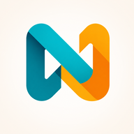

<div align="center">



# Hermex Direct

**A native iOS client and self-hosted NAS Companion for Hermes Agent.**

Personal fork · direct NAS connection · no hosted relay

[](https://developer.apple.com/ios/)
[](https://swift.org)
[](LICENSE)

[Roadmap](PROJECT_SPEC.md) · [Issue tracker](https://github.com/KiRito02/hermex/issues) · [Development](DEVELOPMENT.md)

</div>

## Status

This fork is **in migration**. The inherited Hermex SwiftUI interface is
present, but the approved Companion/Gateway architecture is not implemented
yet. Do not treat the current branch as a finished client or Companion.

- Product direction: App → self-hosted Companion → loopback Hermes Gateway.
- First implementation slice:
  [Issue #1 — Companion pairing, capabilities, and Gateway connection](https://github.com/KiRito02/hermex/issues/1).
- Distribution target: personal sideload, not App Store/TestFlight.
- Current development branch changes remain local until explicitly approved
  for push.

## Goal

Hermex Direct connects an iPhone or iPad to a small Companion running on the
owner's NAS. Companion keeps the Gateway key local, calls
[Hermes Agent](https://github.com/NousResearch/hermes-agent) on loopback, and
adds restricted file/upload/built-in-Memory capabilities.

The fork preserves the useful native Hermex interaction model while replacing
the inherited `hermes-webui` backend:

- native Sessions → Chat navigation and compact composer;
- Markdown, code, math, reasoning, and tool-call presentation;
- local pairing and revocable per-device credentials;
- merged Companion/Gateway capability discovery;
- sessions, streaming runs, reconnect, stop, and approvals;
- Jobs, Skills/Toolsets, models, inline images, adaptive iPad layout;
- restricted NAS file browsing, streaming upload, and built-in Memory
  management;
- offline read-only cache;
- a separate performance track for long, streaming conversations.

`hermes-webui`, a vendor account, and a hosted relay are not required.

## Companion-v1 scope

Required:

- Companion URL plus one-time local pairing.
- Revocable device authentication; `API_SERVER_KEY` stays on the NAS.
- Companion/Gateway readiness and tolerant merged capabilities.
- Session list/history and persisted conversation turns.
- Structured streaming, status recovery, stop, and approvals when advertised.
- Jobs, read-only Skills/Toolsets, models, inline images, and iPad layout.
- Allowed-root file browsing, upload, and built-in Memory management.
- Progressive streaming animation plus a repeatable long-chat benchmark.
- Personal Windows sideload workflow backed by macOS CI.

Not promised in Companion v1:

- Arbitrary filesystem access, delete, terminal, or Git mutation.
- Hermes Bridge Kanban/Boards.
- WebUI projects, cookie profiles, personalities, or insights panels.
- Hosted account/relay service.
- Public App Store/TestFlight distribution.

See [`PROJECT_SPEC.md`](PROJECT_SPEC.md) for the authoritative scope.

## NAS deployment

Configure Hermes Agent on the NAS and keep Gateway on loopback:

```dotenv
API_SERVER_ENABLED=true
API_SERVER_KEY=<long-random-secret>
```

Start it:

```bash
hermes gateway
```

The documented Gateway listener is `127.0.0.1:8642`. Companion calls it
locally; only Companion is exposed. The primary owner deployment uses Lucky as
an HTTPS reverse proxy, with Tailscale HTTPS also supported.

Companion uses Python 3.11, pinned `aiohttp`, standard-library SQLite, a
`uv`-locked isolated environment, XDG-owned configuration/state/releases, and a
systemd service installed directly on the NAS host. Exact commands land with
Issue #1 and must preserve loopback binding and degraded operation when Gateway
is unavailable. Do not expose Gateway directly or place `API_SERVER_KEY` on the
iPhone.

Official API Server documentation:
https://hermes-agent.nousresearch.com/docs/user-guide/features/api-server

## Development workflow

The owner's primary machines are Linux/NAS and Windows:

1. Edit and commit source on Linux/Windows.
2. Ask before pushing a branch.
3. Manually run `PR CI` on a macOS GitHub Actions runner for Xcode
   build/XCTest.
4. After Phase I adds packaging, download the prepared artifact on Windows.
5. Re-sign/install it with AltStore or SideStore.

Local Xcode development requires macOS. Open `HermesMobile.xcodeproj` and use
the `HermesMobile` scheme. The reference simulator is iPhone 17.

Full instructions:

- [`DEVELOPMENT.md`](DEVELOPMENT.md)
- [`CONTRIBUTING.md`](CONTRIBUTING.md)
- [`AGENTS.md`](AGENTS.md)

## Repository workflow

- `master` is the protected integration branch.
- Active work lives in GitHub Issues.
- One Issue → one `issue/<n>-slug` branch → one PR.
- Push, PR creation/update, and merge require explicit owner approval.
- Never invent endpoints or JSON shapes.
- Never commit Companion/Gateway keys, Apple credentials, or owner-specific
  signing IDs.

## Upstream acknowledgement

This fork is based on the open-source
[Hermex](https://github.com/uzairansaruzi/hermex) iOS application and preserves
its MIT license and third-party notices.

Hermex Direct uses
[NousResearch/hermes-agent](https://github.com/NousResearch/hermes-agent)
behind its self-hosted Companion. It is an independent personal client and is
not an official Nous Research, HermesPilot, or upstream Hermex release.

## License

MIT — see [LICENSE](LICENSE).
